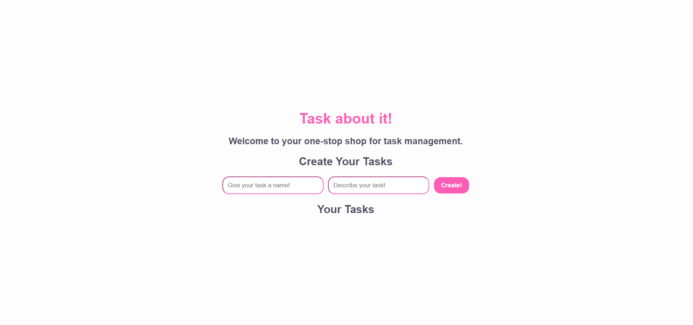
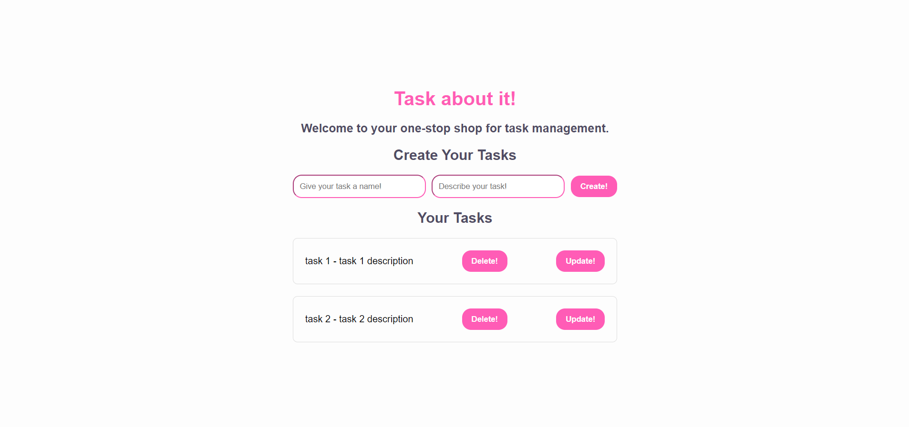
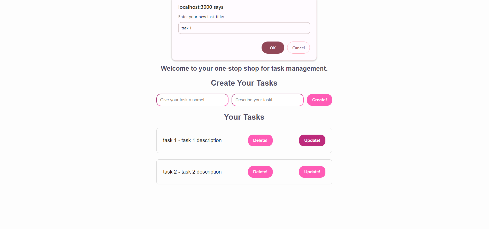
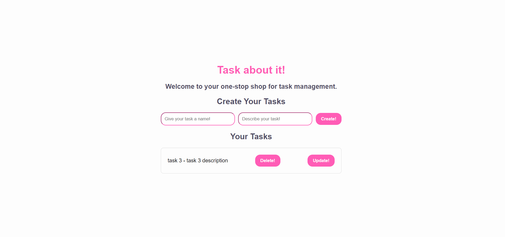

# Task-Manager

## Description
    
**Task About It!** is a simple application designed to help anybody and everybody manage their tasks! Here you can create, update, and delete your own tasks. It's easy-to-use, and completely accessible!

    
## Table of Contents
    
- [Installation](#installation)
- [Usage](#usage)
- [Credits](#credits)
- [Contacts](#contacts)
- [License](#license)
- [How to Contribute](#how-to-contribute)
    
## Installation
    
Open the [Task About It app]( https://rubabas-task-manager-a4515f92930f.herokuapp.com/) on a browser such as Google Chrome, Firefox or Edge etc.

## Usage

Once you have landed on the homepage, as visualised above, you may begin your task creation! You can do this by simply typing in a title and description for your tasks in their assigned fields, and click the "Create!" button to create your tasks.

Once you have created your tasks, you now have the option of updating or deleting your tasks. You can update each task by clicking on the "Update!" button on each task, afterwhich you will be prompted twice -- once to type in a new designated title, and another time to type in a new designated description! After you have typed these in, you may click the "OK" button to move on. Your updated task will then be displayed!

Now that you have updated a task, you may also choose to delete a task! To do this, simply click the "Delete!" Button next to the task you would like to get rid of. Once you click the button, your task will disappear from the displayed task list.

And there you have it! A simple and easy-to-use app for all your task-management needs!

## Credits

Some code inspired by content given in MONU Coding Bootcamp course.

## Contacts

Project Contributers:
- [RubabaKhandaker](https://github.com/RubabaKhandaker)

## License

Please see LICENSE file for more information.  
 
## How to Contribute
    
Feel free to contribute your ideas or bug fixes for this project by raising a new issue or new pull request.